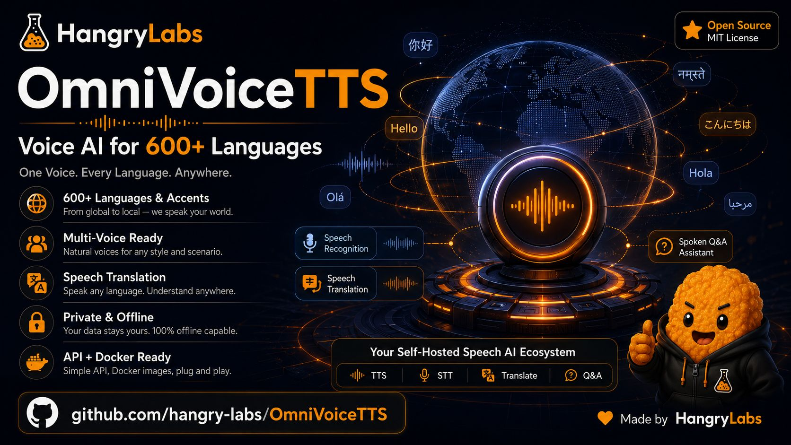
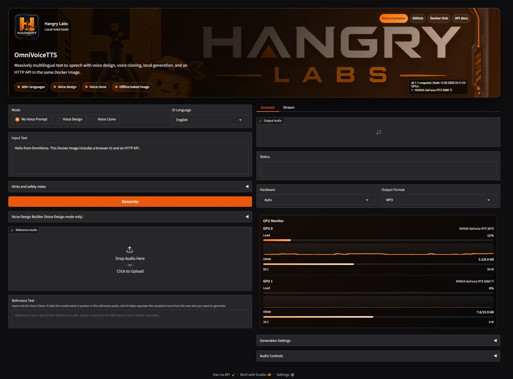

<p align="center">
  <a href="https://hangry-labs.github.io/OmniVoiceTTS/examples/">
    
  </a>
</p>

# Hangry Labs OmniVoiceTTS

Easy-to-run OmniVoice text-to-speech Docker images with a browser UI and HTTP API included.

This Hangry Labs fork is made for ease of use. The aim is that anyone should be able to run massively multilingual text to speech without fighting Python environments, missing model files, or unclear setup: a person trying it at home, a developer wiring it into an app, or a professional evaluating it for local deployment. Install Docker, run one command from Quick Start, open the local link, and start generating speech.

You get:
- A browser UI for auto voice, voice design, and voice cloning
- An HTTP API for your own applications and tools
- No manual Python, model, ASR, or audio dependency setup
- 600+ language support inherited from OmniVoice
- WAV, MP3, FLAC, and OGG output
- GPU acceleration when Docker/NVIDIA support is available
- Offline-friendly usage: download the full image once, keep it, and run it later without relying on live model downloads

Official Docker images are intended for: [hangrylabs/omnivoicetts on Docker Hub](https://hub.docker.com/r/hangrylabs/omnivoicetts/tags).

**Listen to examples first:** [hangry-labs.github.io/OmniVoiceTTS/examples](https://hangry-labs.github.io/OmniVoiceTTS/examples/).

Hangry Labs home: [nuggies.website](https://nuggies.website/).

## Browser UI

The included browser UI is built for local generation, voice design, voice cloning, progressive streaming tests, seed-based reproducibility, output-format control, and live GPU visibility.



---

## Responsible Use

OmniVoice supports voice cloning. Do not use this project for unauthorized voice cloning, impersonation, fraud, harassment, scams, or any illegal or unethical activity. Only clone voices when you have the rights and consent to do so. You are responsible for complying with applicable laws, regulations, platform rules, and ethical standards.

---

## Quick Start

Run with NVIDIA GPU support:

```bash
docker run -p 7861:7861 --gpus "device=0" -e CUDA_VISIBLE_DEVICES=0 hangrylabs/omnivoicetts:latest
```

Run on CPU:

```bash
docker run -p 7861:7861 -e OMNIVOICE_DEVICE=cpu hangrylabs/omnivoicetts:latest
```

Run on a specific GPU (example: GPU index `1`):

```bash
docker run -p 7861:7861 --gpus "device=1" -e CUDA_VISIBLE_DEVICES=1 hangrylabs/omnivoicetts:latest
```

Then open: **[http://localhost:7861](http://localhost:7861)**

The full image is baked with the OmniVoice model, the Higgs audio tokenizer, and Whisper ASR assets. After the image is pulled, normal runtime is configured for offline use with `HF_HUB_OFFLINE=1` and `TRANSFORMERS_OFFLINE=1`. The Python 3.13 baked image was validated with no host model-cache volume mounted.

---

## API Usage Example

Default API behavior returns WAV:

```bash
curl -X POST "http://localhost:7861/tts/generate" \
  -H "Content-Type: application/json" \
  -d '{"text":"Hello from Hangry Labs OmniVoiceTTS.","language":"English"}' \
  -o output.wav
```

Request MP3 when you want compact output:

```bash
curl -X POST "http://localhost:7861/tts/generate" \
  -H "Content-Type: application/json" \
  -d '{"text":"Hello from Hangry Labs OmniVoiceTTS.","language":"English","output_format":"mp3"}' \
  -o output.mp3
```

Voice design:

```bash
curl -X POST "http://localhost:7861/tts/generate" \
  -H "Content-Type: application/json" \
  -d '{"text":"This is a custom designed voice.","language":"English","instruct":"female, low pitch, british accent","output_format":"mp3"}' \
  -o designed.mp3
```

Voice design is for speaker attributes only. Do not combine `instruct` with bracket expression tags such as `[laughter]` or `[sigh]`; use no voice prompt or voice cloning for those expressive tags instead.

Voice cloning with a reference audio path mounted into the container:

```bash
docker run -p 7861:7861 --gpus "device=0" -e CUDA_VISIBLE_DEVICES=0 -v "%cd%/samples:/data" hangrylabs/omnivoicetts:latest
```

```bash
curl -X POST "http://localhost:7861/tts/generate" \
  -H "Content-Type: application/json" \
  -d '{"text":"This voice follows the reference sample.","language":"English","ref_audio":"/data/ref.wav","ref_text":"Transcript of the reference audio.","output_format":"mp3"}' \
  -o cloned.mp3
```

Kokoro-shaped compatibility fields are accepted where they can be translated cleanly. For example, existing callers may send `voice`, `use_gpu`, or `response_format`; OmniVoiceTTS accepts those fields even though OmniVoice uses no-prompt generation, voice design, or reference-audio cloning rather than fixed Kokoro speaker ids.

Output format can be sent as `output_format`, `format`, or Kokoro/OpenAI-style `response_format`.

Useful endpoints:

- `GET /tts/ping`
- `GET /tts/status`
- `GET /tts/defaults`
- `GET /tts/formats`
- `GET /tts/stream-formats`
- `GET /tts/languages`
- `GET /tts/speakers?language=a`
- `GET /tts/voices`
- `GET /tts/voice-design/options`
- `POST /tts/generate`
- `POST /tts/convert`
- `POST /tts/stream`
- `POST /tts/stream-chunks`
- `POST /tts/metrics`
- `POST /tts/purge`

`/tts/generate` and `/tts/convert` return complete generated audio. `/tts/stream` and `/tts/stream-chunks` progressively return encoded audio after each generated long-text chunk; WAV stream requests are returned as MP3 for live playback compatibility.

Interactive API documentation is available at **[http://localhost:7861/tts/docs](http://localhost:7861/tts/docs)**.

### Use From Python

Install this package in a Python project and point the client at a running OmniVoiceTTS server:

```python
from omnivoice import OmniVoiceTTSClient

tts = OmniVoiceTTSClient("http://localhost:7861")

audio = tts.generate(
    text="Hello from my Python app.",
    language="English",
    instruct="female, low pitch, british accent",
    output_format="mp3",
)

audio.save("hello.mp3")
```

---

## Docker Features

- Full baked image with OmniVoice model assets and Whisper ASR assets included
- Optional tiny image target for cache-volume workflows
- GPU acceleration when available
- HTTP API + web UI in one container
- Offline-friendly runtime flags by default
- Persistent Hugging Face cache volume support in the local Taskfile workflow
- Kokoro-shaped compatibility routes for easier integration with existing TTS tooling

---

## Local Development

This repository currently targets Python `>=3.13, <3.14`. The Docker image uses `python:3.13-slim`, and `task deps` regenerates Linux/Python 3.13 requirements.

Build and run the full baked image:

```bash
task image
task imagerun
task imageweb
task imageapi
```

Build and run the tiny image:

```bash
task image-tiny
task imagerun-tiny
```

Hot-swap local service code into the container without rebuilding:

```bash
task localrun
task localrun-tiny
task logs
```

Dependency and cleanup helpers:

```bash
task deps
task imagestop
task nuke
```

`task imagerun` and `task localrun` mount a named Docker volume at `/app/.cache/huggingface` so assets can survive container and image rebuilds. Baked run tasks seed missing cache files from the full image before startup.

Release from a clean tree:

```bash
task release DRY_RUN=1
task release
```

The release task is intentionally allowed to create the release commit, annotated tag, and next-snapshot commit. Outside that bounded release flow, normal project changes should be reviewed and committed by the repository owner.

---

## Original OmniVoice Project

OmniVoice is a massively multilingual zero-shot text-to-speech model supporting 600+ languages. It provides:

- Voice cloning from a short reference audio clip
- Voice design from speaker attributes such as gender, age, pitch, style, English accent, and Chinese dialect
- Auto voice generation with no reference prompt
- Fine-grained controls such as non-verbal symbols and pronunciation correction

Upstream links:

- Original repository: [k2-fsa/OmniVoice](https://github.com/k2-fsa/OmniVoice)
- Hugging Face model: [k2-fsa/OmniVoice](https://huggingface.co/k2-fsa/OmniVoice)
- Hugging Face Space: [k2-fsa/OmniVoice](https://huggingface.co/spaces/k2-fsa/OmniVoice)
- Paper: [arXiv:2604.00688](https://arxiv.org/abs/2604.00688)

Runtime discovery is available from the local API:

- Supported languages: `GET /tts/languages`
- Voice design options: `GET /tts/voice-design/options`
- Output formats: `GET /tts/formats`
- Interactive API reference: `GET /tts/docs`

The original Python CLI tools are still present:

```bash
omnivoice-demo --ip 0.0.0.0 --port 8001
omnivoice-infer --model k2-fsa/OmniVoice --text "Hello world." --output hello.wav
omnivoice-infer-batch --model k2-fsa/OmniVoice --test_list test.jsonl --res_dir results/
```

This fork intentionally removes upstream training, data-preparation, and benchmark-evaluation pipelines from the runtime-focused package. For model training or research reproduction, use the original [k2-fsa/OmniVoice](https://github.com/k2-fsa/OmniVoice) repository.

---

## About This Fork

This project is an independently maintained packaging and serving fork of the original [OmniVoice](https://github.com/k2-fsa/OmniVoice) project by k2-fsa and contributors.

The upstream model and research are the core contribution. This Hangry Labs fork focuses on making OmniVoice simple to run and integrate: Docker image, included UI, HTTP API, offline-friendly baked assets, practical examples, and release tooling.

License and attribution are preserved in [LICENSE](LICENSE).

---

## Support & Issues

If you encounter bugs, have feature requests, or need help using Hangry Labs OmniVoiceTTS:

- Open a new [GitHub Issue](https://github.com/Hangry-Labs/OmniVoiceTTS/issues) with as much detail as possible
- Include error messages, logs, Docker command, GPU/CPU mode, and reproduction steps
- For upstream model behavior, also check the original [k2-fsa/OmniVoice](https://github.com/k2-fsa/OmniVoice) project

---

## Version History

### v0.1.0

- Forked OmniVoice into a Hangry Labs runtime-focused project for local TTS use.
- Added Python 3.13 support with pinned runtime dependencies, refreshed lockfiles, and Docker images based on `python:3.13-slim`.
- Added full baked Docker packaging that prefetches OmniVoice, the Higgs audio tokenizer, and Whisper ASR assets for offline-friendly runtime after image pull.
- Added a tiny Docker target for persistent Hugging Face cache-volume workflows.
- Added GitHub Actions for full and tiny Docker Hub image publishing on `master`, release tags, and manual dispatch.
- Added a unified Gradio browser UI and FastAPI HTTP API on port `7861`.
- Added auto voice, structured voice design, and reference-audio voice cloning workflows.
- Added discovery/status endpoints for ping, status, defaults, formats, languages, speakers, voices, voice-design options, metrics, and OpenAPI docs.
- Added synthesis endpoints for generate, convert, progressive chunk streaming, and purge.
- Added WAV, MP3, FLAC, and OGG output support, plus `output_format`, `format`, and Kokoro/OpenAI-style `response_format` compatibility.
- Added Kokoro-shaped compatibility fields/routes where they can be translated cleanly, including `voice`, `use_gpu`, `/tts/voices`, `/tts/speakers`, `/tts/stream-formats`, `/tts/convert`, and `/tts/stream`.
- Added advanced generation controls for guidance, denoise/preprocess/postprocess, chunking, temperature, layer penalty, pitch, tempo, volume, and loudness normalization.
- Added a dependency-free Python HTTP client.
- Added Taskfile workflows for image build, image run, local bind-mounted run, API smoke testing, logs, cleanup, release, app injection, NAS shell access, and local dev process cleanup.
- Removed upstream training, data-preparation, evaluation, fine-tuning, and benchmark workflows from this fork to keep the project focused on inference, UI, API, and Docker runtime.
- Simplified public docs to README plus Docker Hub docs, with runtime discovery delegated to API endpoints.
- Added Hangry Labs branding assets, static 404 page, Docker Hub documentation, and a GitHub Pages examples showcase.
- Added 20-language public audio examples with 280 MP3 files: 10 random voice-variety samples, 3 translated intros, and 1 cross-language clone demo per language.
- Added native-language example-page controls, embedded manifest data for fetch-free GitHub Pages/direct-file preview, custom audio cards, progress bars, shared volume/mute, random intro playback, and a highlighted clone demo.
- Added a runtime guard that blocks voice-design `instruct` together with bracket expression tags such as `[laughter]` and `[sigh]`, after testing showed that combination can produce unstable non-speech audio.
- Regenerated affected non-verbal public examples without voice-design `instruct`, avoiding whisper plus bracket tags and placing tags inside sentences with follow-up text.
- Validated a fresh Python 3.13 baked image without a host model-cache volume mounted, with offline flags enabled, GPU inference, all output formats, stream/convert routes, purge, and reload from baked cache.

---

## Citation

If you use OmniVoice in research, cite the upstream work:

```bibtex
@article{zhu2026omnivoice,
      title={OmniVoice: Towards Omnilingual Zero-Shot Text-to-Speech with Diffusion Language Models},
      author={Zhu, Han and Ye, Lingxuan and Kang, Wei and Yao, Zengwei and Guo, Liyong and Kuang, Fangjun and Han, Zhifeng and Zhuang, Weiji and Lin, Long and Povey, Daniel},
      journal={arXiv preprint arXiv:2604.00688},
      year={2026}
}
```

---

## License

This fork is licensed under the [Apache License 2.0](LICENSE).

Original work by k2-fsa and contributors in [OmniVoice](https://github.com/k2-fsa/OmniVoice). The upstream responsible-use disclaimer is preserved in spirit here: users must not use this model for unauthorized voice cloning, voice impersonation, fraud, scams, or any other illegal or unethical activities.
