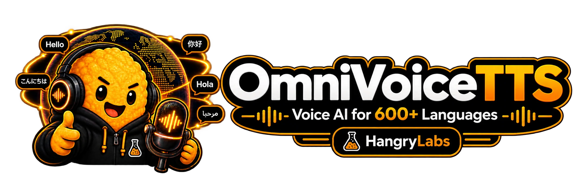
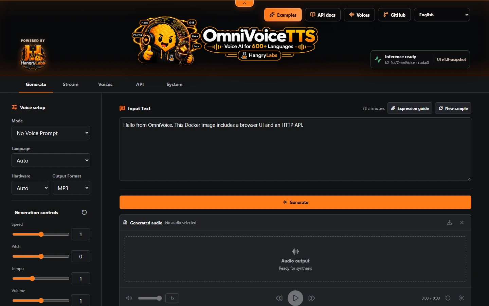

<p align="center">
  <a href="https://hangry-labs.github.io/OmniVoiceTTS/examples/">
    
  </a>
</p>

<p align="center">
  <strong>English</strong> ·
  <a href="README.nb.md">Norsk bokmål</a> ·
  <a href="README.pl.md">Polski</a> ·
  <a href="README.ja.md">日本語</a> ·
  <a href="README.zh.md">简体中文</a> ·
  <a href="README.es.md">Español</a>
</p>

# Hangry Labs OmniVoiceTTS

Easy-to-run OmniVoice text-to-speech Docker images with a browser UI and HTTP API included.

This Hangry Labs fork is made for ease of use. The aim is that anyone should be able to run massively multilingual text to speech without fighting Python environments, missing model files, or unclear setup: a person trying it at home, a developer wiring it into an app, or a professional evaluating it for local deployment. Install Docker, run one command from Quick Start, open the local link, and start generating speech.

## What This Project Provides

- A browser UI for auto voice, voice design, and voice cloning
- Explicit SSML and SSML-H input modes for controlled speech and multi-character dialogue
- An HTTP API for your own applications and tools
- No manual Python, model, ASR, or audio dependency setup
- 600+ language support inherited from OmniVoice
- WAV, MP3, FLAC, and OGG output
- GPU acceleration when Docker/NVIDIA support is available
- Offline-friendly usage: download the full image once, keep it, and run it later without relying on live model downloads

Official images are published to [Docker Hub](https://hub.docker.com/r/hangrylabs/omnivoicetts/tags) and [GitHub Container Registry](https://github.com/Hangry-Labs/OmniVoiceTTS/pkgs/container/omnivoicetts).

> [!IMPORTANT]
> The repository source code is Apache-2.0, but the default pretrained OmniVoice checkpoint is described by upstream as **CC-BY-NC** and is not licensed for commercial use. The embedded Higgs Audio 2 tokenizer has separate Boson and Meta Llama 3 terms, including an expanded-license threshold above 100,000 annual active users. Read [Third-Party Notices](THIRD_PARTY_NOTICES.md) before deployment or redistribution.

**Listen to examples first:** [language and voice examples](https://hangry-labs.github.io/OmniVoiceTTS/examples/) or [multi-character SSML-H conversations](https://hangry-labs.github.io/OmniVoiceTTS/examples/ssml-h.html).

Product page and installation guide: [hangrylabs.app/software/omnivoicetts](https://hangrylabs.app/software/omnivoicetts).

Hangry Labs home: [hangrylabs.app](https://hangrylabs.app/).

The complete browser interface is included in the image and is available immediately after startup:

<p align="center">
  <a href="https://hangry-labs.github.io/OmniVoiceTTS/examples/">
    
  </a>
</p>

## Quick Start

Run with NVIDIA GPU support:

```bash
docker run --name omnivoicetts --restart unless-stopped -p 7861:7861 --gpus all -e CUDA_VISIBLE_DEVICES=0 -v omnivoicetts_data:/app/persistent hangrylabs/omnivoicetts:latest
```

Run on CPU:

```bash
docker run --name omnivoicetts --restart unless-stopped -p 7861:7861 -e OMNIVOICE_DEVICE=cpu -e OMNIVOICE_LOAD_ASR=0 -v omnivoicetts_data:/app/persistent hangrylabs/omnivoicetts:latest
```

CPU mode is supported as a fallback, but it still needs enough system memory. For a 140-character CPU benchmark request, conservative rounded Docker RAM recommendations were: 2 GB for random/no-prompt voice, voice design, and direct clone with transcript; 3 GB for a stored voice profile with transcript; 6 GB for direct clone without transcript; and 7 GB for a stored voice profile without transcript. The no-transcript paths may lazy-load ASR, which is why they need much more RAM. Use more for longer text, concurrent requests, larger outputs, or host environments with tighter memory behavior.

When running on CPU, `/tts/status` reports container/system memory diagnostics and per-scenario RAM recommendations. If a CPU request appears close to the available memory limit, the container logs a warning and still tries to continue; Docker or the OS may still kill the process if RAM is exhausted.

If a CPU container exits after `Loading weights` during a cloned-voice `/v1/audio/speech` request, it is usually an out-of-memory kill rather than a Python exception. The TTS model already needs significant RAM on CPU, and clone/profile requests without a transcript can lazy-load Whisper ASR to transcribe the reference audio. Recent snapshots reduce the default footprint by keeping eager ASR off on CPU, but no-transcript clone paths still need more memory. To lower RAM use: run `latest` or a current version tag, keep `OMNIVOICE_LOAD_ASR=0`, do not set `OMNIVOICE_ALLOW_CPU_EAGER_ASR=1`, save voice profiles with a reference transcript, include `ref_text` when sending direct `ref_audio`, keep concurrency at the default `OMNIVOICE_MAX_CONCURRENT_GENERATIONS=1`, and prefer GPU mode when available. See [`benchmarks/memory/cpu/BENCHMARKS.md`](benchmarks/memory/cpu/BENCHMARKS.md) for measured scenario recommendations and run `task benchmark-memory-cpu` on your host if you need local numbers.

Run on a specific GPU (example: GPU index `1`):

```bash
docker run --name omnivoicetts --restart unless-stopped -p 7861:7861 --gpus all -e CUDA_VISIBLE_DEVICES=1 -v omnivoicetts_data:/app/persistent hangrylabs/omnivoicetts:latest
```

Then open: **[http://localhost:7861](http://localhost:7861)**

The named `omnivoicetts_data` volume stores model assets, application settings, and voices created in the UI so they survive container replacement and image updates. Docker creates it automatically on first use.

The full image is baked with pinned OmniVoice, Higgs audio tokenizer, and Whisper ASR assets. At startup, it incrementally seeds missing or updated baked cache files into `/app/persistent/models/huggingface`; existing downloaded models, saved voices, and settings are preserved. Normal runtime is then configured for offline use with `HF_HUB_OFFLINE=1` and `TRANSFORMERS_OFFLINE=1`. CPU runs should keep eager ASR disabled; saved voice profiles with transcripts do not need Whisper at request startup, and ASR can still lazy-load only when a reference audio request omits `ref_text`. To force eager Whisper preload on CPU anyway, set `OMNIVOICE_ALLOW_CPU_EAGER_ASR=1`. The Python 3.13 baked image was validated with no host model-cache volume mounted.

## Tiny Image

Use `latest_tiny` when you want runtime dependencies in the image but prefer model assets to download into the persistent volume on first online use:

```bash
docker run --name omnivoicetts-tiny --restart unless-stopped -p 7861:7861 --gpus all -e CUDA_VISIBLE_DEVICES=0 -e HF_HUB_OFFLINE=0 -e TRANSFORMERS_OFFLINE=0 -v omnivoicetts_data:/app/persistent hangrylabs/omnivoicetts:latest_tiny
```

Later image versions reuse the same `omnivoicetts_data` volume, so downloaded models, saved voices, and operator settings remain available.

## Image Tags

- `latest` - rolling full snapshot from `master`
- `latest_tiny` - rolling tiny snapshot from `master`
- `vX.Y` or `vX.Y.Z` - immutable full release, for example `v1.0`
- `vX.Y_tiny` or `vX.Y.Z_tiny` - immutable tiny release, for example `v1.0_tiny`

Published GitHub Releases and their Git tags are immutable. Versioned Docker image tags are likewise immutable and cannot be reassigned to a different image; `latest` and `latest_tiny` intentionally remain movable snapshot channels.

Snapshot or development version tags are intentionally not published. Release tags are created only when the project is ready for a release.
- Full and tiny images are published to Docker Hub and GitHub Container Registry.

## Browser UI

The included standalone browser UI provides focused Generate, Stream, Voices, API, and System workspaces. Generate and Stream keep the primary text, voice, language, and output controls together; Voices manages reusable cloned profiles; API exposes local integration details and recent calls; and System places runtime and memory controls beside the wider GPU overview. Generated, streamed, and reference audio use the same local waveform workspace with playback, seeking, speed, volume, trim, download, share, and removal controls.

The responsive interface includes 60 display languages, uses bundled WebP assets, and is served directly by the local FastAPI application without a CDN or separate frontend service.

## MCP For Local Agents

OmniVoiceTTS provides two opt-in Streamable HTTP MCP endpoints on the existing application port. Open **System > MCP access** to enable either endpoint; the choices are stored in the persistent product volume and take effect immediately without restarting the container.

- `http://localhost:7861/mcp/` is the recommended compact endpoint. Its five tools cover health, language search, saved-voice discovery, speech inspection, and simple speech generation. Use this endpoint for small models and routine text-to-speech so advanced schemas do not occupy their context.
- `http://localhost:7861/mcp/advanced/` contains the same five tools plus advanced generation, one-off reference cloning, voice design, and saved-profile creation/deletion. Enable and connect it only when those capabilities are needed.

`talk_simple` is the preferred generation tool and requires only `text`; language detection, automatic voice, MP3 output, a fixed seed, and a one-hour artifact lifetime are safe defaults. Agents may optionally provide a language, a saved `voice_id`, or another artifact lifetime. `get_cloned_voices_catalog` returns only profiles stored by this deployment, including their exact reusable IDs and human descriptions. An empty result simply means no custom voice has been saved yet.

Generation tools return metadata and an expiring capability URL, never raw audio or base64 in the MCP response. Generated files live under `/app/persistent/mcp-output`. Advanced local-reference tools accept files only from `/app/persistent/mcp-input`, or bounded HTTP(S) URLs; neither the catalog nor MCP responses expose internal profile paths.

Both endpoints are disabled by default and have no separate application authentication. Enable them only for trusted clients or behind your own authenticated reverse proxy. They can also be enabled at container startup:

```bash
docker run --name omnivoicetts --restart unless-stopped -p 7861:7861 --gpus all -e CUDA_VISIBLE_DEVICES=0 -e OMNIVOICE_ENABLE_MCP=1 -e OMNIVOICE_ENABLE_ADVANCED_MCP=0 -e OMNIVOICE_MCP_BASE_URL=http://localhost:7861 -v omnivoicetts_data:/app/persistent hangrylabs/omnivoicetts:latest
```

Set `OMNIVOICE_MCP_BASE_URL` to the externally reachable origin when the MCP client runs on another machine; generated download links are built from this value. The environment flags are startup defaults, while values saved from the System UI take precedence afterward. Run `task mcp-live-test` against a local deployment to verify both tool tiers and real linked-audio generation.

## API Usage Example

Default API behavior returns WAV:

```bash
curl -X POST "http://localhost:7861/tts/generate" \
  -H "Content-Type: application/json" \
  -d '{"text":"Hello from Hangry Labs OmniVoiceTTS.","language":"English"}' \
  -o output.wav
```

Request MP3 when you want compact output:

```bash
curl -X POST "http://localhost:7861/tts/generate" \
  -H "Content-Type: application/json" \
  -d '{"text":"Hello from Hangry Labs OmniVoiceTTS.","language":"English","output_format":"mp3"}' \
  -o output.mp3
```

Voice design:

```bash
curl -X POST "http://localhost:7861/tts/generate" \
  -H "Content-Type: application/json" \
  -d '{"text":"This is a custom designed voice.","language":"English","instruct":"female, low pitch, british accent","output_format":"mp3"}' \
  -o designed.mp3
```

Voice design is for speaker attributes only. Do not combine `instruct` with bracket expression tags such as `[laughter]` or `[sigh]`; use no voice prompt or voice cloning for those expressive tags instead.

Voice cloning with a reference audio path mounted into the container:

```bash
docker run --name omnivoicetts --restart unless-stopped -p 7861:7861 --gpus all -e CUDA_VISIBLE_DEVICES=0 -v omnivoicetts_data:/app/persistent -v "%cd%/samples:/data" hangrylabs/omnivoicetts:latest
```

```bash
curl -X POST "http://localhost:7861/tts/generate" \
  -H "Content-Type: application/json" \
  -d '{"text":"This voice follows the reference sample.","language":"English","ref_audio":"/data/ref.wav","ref_text":"Transcript of the reference audio.","output_format":"mp3"}' \
  -o cloned.mp3
```

API clients can also upload a one-off reference without mounting a host directory. Send the audio as multipart field `audio` and the normal `/tts/generate` JSON object as field `request`; `ref_text` remains optional and avoids loading ASR when supplied:

```bash
curl -X POST "http://localhost:7861/tts/generate-upload" \
  -F "audio=@ref.wav" \
  -F 'request={"text":"This voice follows the uploaded sample.","language":"English","ref_text":"Transcript of the reference audio.","output_format":"mp3"}' \
  -o cloned.mp3
```

The upload is bounded by `OMNIVOICE_UI_UPLOAD_LIMIT_MIB` (64 MiB by default), decoded before inference, and deleted after the request.

Reference uploads are analyzed for duration, level, clipping, and clean leading/trailing silence. The browser shows these diagnostics before one-off cloning or profile creation, and API users can inspect an allowed container-local path through `POST /tts/reference-audio/analyze` with `{"ref_audio":"/data/ref.wav"}`. With the default `preprocess_prompt=true`, clone preparation preserves the original speech samples while adding any missing silence up to a 100 ms leading and 200 ms trailing floor. Audio-tokenizer alignment pads the protected ending instead of discarding a partial final frame. This specifically protects very short cloned output from references that start or end directly on speech; disabling prompt preprocessing retains the caller's explicit raw-reference behavior.

Kokoro-shaped compatibility fields are accepted where they can be translated cleanly. Existing callers may send `voice`, `use_gpu`, or `response_format`. The `voice` field can name a saved local voice profile or an OpenAI-style alias such as `nova`; unknown Kokoro speaker ids are accepted for compatibility but ignored because OmniVoice uses no-prompt generation, voice design, or reference-audio cloning rather than fixed speaker ids.

Output format can be sent as `output_format`, `format`, or Kokoro/OpenAI-style `response_format`.

OpenAI-compatible speech clients can call the local server through `/v1/audio/speech`:

```bash
curl -X POST "http://localhost:7861/v1/audio/speech" \
  -H "Content-Type: application/json" \
  -d '{"model":"tts-1","voice":"nova","input":"Hello from an OpenAI-compatible local OmniVoiceTTS endpoint.","response_format":"mp3"}' \
  -o openai-speech.mp3
```

Model discovery through `/v1/models` reports the local `omnivoice` model. For client compatibility, speech requests also accept `omnivoicetts`, `tts-1`, `tts-1-hd`, and `gpt-4o-mini-tts` as aliases; all of them map to the same local OmniVoice model. OpenAI-style voice names such as `alloy`, `echo`, `fable`, `onyx`, `nova`, and `shimmer` are accepted as local compatibility aliases.

For OpenAI-compatible TTS, standard voice aliases use a local built-in clone reference by default so sentence-by-sentence playback stays closer to the same speaker identity. Advanced clients may also pass OmniVoice extensions such as `language`, `seed`, `randomize_seed`, `normalize_text`, `voice_profile`, `ref_audio`, and `ref_text` in the request body.

The browser UI includes a **Voices** tab where you can upload or drop a reference sample, inspect or trim its waveform, and save it as a named local voice profile. The workflow previews the normalized profile id, warns before an existing id is replaced, identifies profiles that need on-demand ASR, and provides search, use, and guarded delete actions. The profile stores a short human description, its clone/design type, default language, seed, seed-randomization behavior, copied reference audio, and optional transcript. Descriptions let people use short stable IDs while giving MCP agents enough context to select the correct voice. In OpenWebUI, set the TTS voice to the saved profile name, for example `my-voice`.

OpenAI-compatible clients can also select or override that profile through additional request parameters:

```json
{
  "voice_profile": "my-voice",
  "language": "English",
  "seed": 12345,
  "randomize_seed": false
}
```

Voice profiles are stored under `/app/persistent/voices/openai` inside the unified product volume, so profiles survive container replacement.

The same saved profiles and built-in aliases are available on native `/tts/generate`, `/tts/convert`, `/tts/stream`, and `/tts/stream-chunks` requests through either `voice` or `voice_profile`. Explicit `ref_audio` still takes precedence when provided.

### Structured Text

Plain English, Malayalam, and Vietnamese requests can opt into conservative structured-text normalization with `"normalize_text": true`. English normalization expands integers, decimals, percentages, currencies, ISO dates (`YYYY-MM-DD`), phone numbers, email addresses, URLs, and explicit alphanumeric identifiers. Malayalam normalization expands integers up to 99 lakh, decimals, percentages, currencies, common measurement units, times, common fractions, English-style ordinals, and uppercase acronyms. Vietnamese normalization expands unambiguous integers, decimals, percentages, marked currencies, common measurement units, ISO dates, and times. Normalization runs before duration estimation and synthesis. The same flag is available in the browser, native APIs, the OpenAI-compatible endpoint, Python client, direct model calls, and both inference CLIs.

The browser shows the exact spoken form before generation. API clients can inspect it without loading the model:

```bash
curl -X POST "http://localhost:7861/tts/text/normalize" \
  -H "Content-Type: application/json" \
  -d '{"text":"Email ops@example.com about invoice 42 due on 2026-08-12.","language":"English"}'
```

Normalization is off by default and applies only to plain text. SSML, SSML-H, voice-clone reference transcripts, bracket controls, and ARPABET controls are never rewritten. Ambiguous values are preserved and reported as warnings instead of being guessed. English, Malayalam, and Vietnamese are supported; Malayalam script can be detected automatically, while an explicit language is recommended for Vietnamese. Vietnamese phone numbers, identifiers, slash forms, lone dotted values, and malformed dates or times remain unchanged unless their meaning is made explicit by a supported marker. Unsupported explicit languages are returned unchanged.

### SSML And SSML-H

The native generation routes support explicit `input_type` values of `text`, `ssml`, and `ssml-h`. Plain text remains the default; markup is never inferred. The browser Generate and Stream workspaces expose the same three modes with working samples.

Standard SSML example:

```bash
curl -X POST "http://localhost:7861/tts/generate" \
  -H "Content-Type: application/json" \
  -d '{"input_type":"ssml","text":"<speak version=\"1.1\" xml:lang=\"en-US\">Welcome to <sub alias=\"Hangry Labs\">HangryLabs</sub>.<break time=\"300ms\"/><prosody rate=\"slow\" pitch=\"+2st\">This uses standard SSML controls.</prosody></speak>","output_format":"mp3"}' \
  -o ssml.mp3
```

[SSML-H 1.0](https://hangrylabs.app/ns/ssml-h/1.0) extends standard SSML metadata with dynamic voice definitions. Parsing, validation, resource limits, and immutable synthesis plans come from the versioned [`ssml-h-tools`](https://pypi.org/project/ssml-h-tools/) package; OmniVoiceTTS supplies the model-specific language, voice, phoneme, profile, and audio execution adapters. `scope="request"` keeps a generated character in memory only. `scope="profile"` publishes it as a normal reusable voice profile only after synthesis and output encoding succeed.

The public [SSML-H conversation showcase](https://hangry-labs.github.io/OmniVoiceTTS/examples/ssml-h.html) includes generated mother/daughter, model-meeting, and navigation dialogues with their complete source documents. Regenerate the checked-in audio against a local container with `task generate-ssml-h-examples`.

When a dynamic voice omits `<h:sample>`, OmniVoiceTTS designs it from one fixed internal English reference sentence. Dialogue text is never reused as voice-training material. Provide `<h:sample xml:lang="...">...</h:sample>` when a specific reference phrase or language is required.

```json
{
  "input_type": "ssml-h",
  "output_format": "mp3",
  "text": "<speak version=\"1.1\" xmlns=\"http://www.w3.org/2001/10/synthesis\" xmlns:h=\"https://hangrylabs.app/ns/ssml-h/1.0\" xml:lang=\"en-US\"><metadata><h:extensions version=\"1.0\"><h:voice-definition name=\"Bob\" gender=\"male\" age=\"elderly\" accent=\"american\" scope=\"request\" seed=\"4242\"><h:sample xml:lang=\"en-US\">My name is Bob. I am ready for this conversation.</h:sample></h:voice-definition></h:extensions></metadata><voice name=\"Bob\">Are we ready?</voice></speak>"
}
```

OmniVoiceTTS supports a bounded SSML 1.1-compatible subset: `speak`, `metadata`, `p`, `s`, `token`, `w`, `voice`, `lang`, `break`, `prosody`, `sub`, `say-as`, and English `x-arpabet` phonemes. Generic IPA, remote `audio`, external lexicons, DTDs, entities, and external XML references are rejected. Query `GET /tts/ssml/capabilities` for the machine-readable feature and limit contract. The OpenAI-compatible endpoint remains plain text because SSML is not part of that compatibility contract.

Useful endpoints:

- `GET /v1/models`
- `GET /v1/models/{model}`
- `GET /v1/audio/models`
- `GET /v1/audio/voices`
- `POST /v1/audio/speech`
- `GET /tts/ping`
- `GET /tts/ready`
- `GET /tts/status`
- `GET /tts/defaults`
- `GET /tts/formats`
- `GET /tts/stream-formats`
- `GET /tts/languages`
- `GET /tts/speakers?language=a`
- `GET /tts/voices`
- `GET /tts/voice-profiles`
- `POST /tts/voice-profiles`
- `DELETE /tts/voice-profiles/{name}`
- `GET /tts/voice-design/options`
- `GET /tts/ssml/capabilities`
- `POST /tts/text/normalize`
- `GET /tts/openai-calls`
- `POST /tts/generate`
- `POST /tts/generate-upload`
- `POST /tts/convert`
- `POST /tts/stream`
- `POST /tts/stream-chunks`
- `POST /tts/cache/clear`
- `POST /tts/metrics`
- `POST /tts/preflight`
- `POST /tts/purge`
- `GET /system/settings`
- `PUT /system/settings/generation-defaults`
- `PUT /system/settings/mcp`
- `GET /system/gpu`

`/tts/generate` and `/tts/convert` return complete generated audio. `/tts/stream` and `/tts/stream-chunks` progressively return encoded audio after each generated long-text chunk and support the same `voice`/`voice_profile` profile resolution; WAV stream requests are returned as MP3 for live playback compatibility.

`GET /tts/ping` remains the cheap process liveness check used by Docker. `GET /tts/ready` is the stronger orchestrator check: it resolves the configured device, waits for generation capacity, loads or verifies the model, and returns `200` only when inference assets are ready (`503` otherwise). The first readiness call can therefore take as long as a normal cold model load.

`POST /tts/preflight` loads the configured model and uses its real text tokenizer, punctuation handling, duration estimator, and chunking thresholds to report character/word counts, text-token counts, estimated audio tokens, rough duration, and estimated chunk count without generating audio. `/tts/metrics` remains the lightweight, no-model-load text and SSML structure inspector.

Generated audio edge handling can be tuned with `pad_duration` and `fade_duration` on `/tts/generate`, `/tts/convert`, `/tts/stream`, `/tts/stream-chunks`, and `/v1/audio/speech`. `pad_duration` adds silence before and after the clip; `fade_duration` fades the clip in and out to reduce clicks. Both default to `0.1` seconds and can be set to `0` to disable.

Advanced output mastering keeps the established sound and timing defaults while making the individual stages configurable. Silence cleanup now uses `float_preserving_silence=true` by default so Pydub detects ranges without rebuilding retained speech through PCM16; set it to `false` for the legacy path when comparing an unusual output. `output_min_silence_ms`, `output_keep_silence_ms`, `output_lead_silence_ms`, and `output_trail_silence_ms` control long-gap shortening and retained edges. `output_preserve_active_edges` optionally protects quiet nonzero attacks/releases, and `output_peak_limit` applies a duration-preserving peak ceiling when set. The browser exposes these under **Advanced generation > Output mastering** with a dedicated reset-to-defaults action. The same fields are available through native and OpenAI-compatible APIs, the Python client, and both inference CLIs.

The optional `duration` field is an audio-token budget expressed in seconds, not an exact physical waveform length. It overrides `speed` for model generation, while codec decoding and output processing can still produce a slightly different final duration.

Before inference, attached ASCII question and exclamation marks at sentence boundaries are automatically separated from the preceding word. This maps inputs such as `Jesteśmy gotowi do ofiary?` to the model-compatible token form `Jesteśmy gotowi do ofiary ?`, which avoids an observed final-syllable truncation case. This is text-token normalization, not audio silence padding; compact CJK punctuation is left unchanged.

Docker images default to `OMNIVOICE_MAX_CONCURRENT_GENERATIONS=1`, so concurrent API callers queue on each resolved device instead of overlapping GPU-heavy generation. `/tts/status` reports active/queued generation operations, completed/failed/cancelled totals, queue and generation timing aggregates, the last correlated request ID, plus CUDA `allocated`, `reserved`, and peak allocator counters. `POST /tts/cache/clear` releases unused PyTorch CUDA allocator blocks without unloading model weights or saved voice-prompt cache entries; `POST /tts/purge` unloads cached models and then performs the stronger CUDA allocator cleanup. `OMNIVOICE_EMPTY_CUDA_CACHE_AFTER_REQUEST=1` can force allocator cleanup after every request, but it is off by default because it may reduce throughput.

Every HTTP response includes `X-Request-ID`. Clients may supply their own safe identifier in that header; otherwise the server generates one. Validation, HTTP, and internal failures return a structured `error` object containing the same request ID while retaining FastAPI's top-level `detail` field for compatibility.

Interactive API documentation is available at **[http://localhost:7861/tts/docs](http://localhost:7861/tts/docs)**.

### Use From Python

Install this package in a Python project and point the client at a running OmniVoiceTTS server:

```python
from omnivoice import OmniVoiceTTSClient

tts = OmniVoiceTTSClient("http://localhost:7861")

audio = tts.generate(
    text="Invoice 42 is due on 2026-08-12.",
    language="English",
    normalize_text=True,
    instruct="female, low pitch, british accent",
    output_format="mp3",
)

audio.save("hello.mp3")
```

OpenAI-shaped speech calls can also be made through the bundled client:

```python
from omnivoice import OmniVoiceTTSClient

tts = OmniVoiceTTSClient("http://localhost:7861")
audio = tts.openai_speech(
    model="tts-1",
    voice="nova",
    input="Hello from an OpenAI-compatible local endpoint.",
    response_format="mp3",
)
audio.save("openai-speech.mp3")
```

---

## Docker Features

- Full baked image with OmniVoice model assets and Whisper ASR assets included
- Optional tiny image target for cache-volume workflows
- GPU acceleration when available
- Stored OpenAI voice profiles reuse cached clone prompts after the first request
- Tune generated clip edge silence and fade with `pad_duration` and `fade_duration`
- Preview and opt into conservative English, Malayalam, and Vietnamese structured-text speech normalization
- Serialized GPU generation by default to avoid concurrent VRAM spikes
- CUDA allocator diagnostics and cache clearing without unloading model weights
- Automatic Librosa resampling fallback when optional `torchaudio` is unavailable; force either backend with `OMNIVOICE_RESAMPLE_BACKEND`
- HTTP API + web UI in one container
- Offline-friendly runtime flags by default
- One persistent product volume for model assets, operator settings, and saved voices
- Kokoro-shaped compatibility routes for easier integration with existing TTS tooling

---

## FAQ

### Why does OmniVoiceTTS not support FlashAttention?

We tested FlashAttention-2 with the official Dao-AILab wheel for Python 3.13, Torch 2.8, and CUDA 12.8. It installed and ran, but it did not improve the workloads this project is built around. For normal UI/OpenAI-compatible usage, where clients often send one sentence per request, it made generation substantially slower.

Single-request API benchmark on RTX 5060 Ti, 100 calls per category:

| Category | Standard attention avg | FlashAttention avg | Result |
|---|---:|---:|---:|
| Random/no reference | 1.104s | 1.537s | 39.2% slower |
| Predefined cached voice | 1.036s | 1.628s | 57.1% slower |
| Direct reference audio | 1.498s | 2.010s | 34.2% slower |

We also tested true batched generation. Batch size 4 was still slower with FlashAttention. Batch size 10 showed small gains for clone paths but not for random/no-reference generation:

| Batch category | Standard attention avg | FlashAttention avg | Result |
|---|---:|---:|---:|
| Random/no reference, batch 10 | 0.638s/item | 0.657s/item | 3.0% slower |
| Predefined cached voice, batch 10 | 0.995s/item | 0.955s/item | 4.0% faster |
| Direct reference audio, batch 10 | 1.419s/item | 1.372s/item | 3.3% faster |

A larger 100-message batch gave only a small random/no-reference improvement, then became impractical for clone benchmarking on the 16 GB RTX 5060 Ti:

| Batch category | Standard attention | FlashAttention | Result |
|---|---:|---:|---:|
| Random/no reference, one 100-message batch | 92.18s total | 89.63s total | 2.8% faster |
| Predefined/clone, one 100-message batch | exceeded 900s timeout | not completed | impractical |

The FlashAttention experiment also increased image complexity and size, added another GPU-specific binary dependency, consumed more VRAM in large-batch tests, and produced worse stability characteristics for the use cases we actually support. Based on those results, OmniVoiceTTS intentionally does not ship FlashAttention support. The same lesson applies to other Hangry Labs speech projects: do not assume FlashAttention helps STT/TTS workloads without project-specific benchmarks.

## Runtime Settings and Persistent Data

The single `omnivoicetts_data` volume is mounted at `/app/persistent` and owns durable product data:

- `/app/persistent/models/huggingface` - baked or downloaded model assets
- `/app/persistent/app/settings.json` - atomic operator settings used by the current and future System UI
- `/app/persistent/voices/openai` - saved voice profiles and their reference audio
- `/app/persistent/mcp-input` - operator-provided audio available to advanced MCP tools
- `/app/persistent/mcp-output` - expiring generated MCP audio artifacts

The relevant path overrides are `HF_HOME`, `OMNIVOICE_SETTINGS_PATH`, and `OMNIVOICE_OPENAI_VOICE_PROFILE_DIR`. Restart-bound deployment controls such as model, device, ASR loading, and generation concurrency remain environment variables. `OMNIVOICE_ASR_MODEL` selects the ASR checkpoint used by eager and lazy reference transcription; optional `OMNIVOICE_ASR_DEVICE` can place it on a different device such as `cpu` or `cuda:1`.

Existing users can migrate the two legacy volumes into the unified layout without deleting the originals:

```bash
docker run --rm --entrypoint sh -v omnivoicetts_hf_cache:/legacy/huggingface:ro -v omnivoicetts_openai_voice_profiles:/legacy/voices:ro -v omnivoicetts_data:/app/persistent hangrylabs/omnivoicetts:latest_tiny -c "mkdir -p /app/persistent/models/huggingface /app/persistent/voices/openai /app/persistent/app && cp -an /legacy/huggingface/. /app/persistent/models/huggingface/ && cp -an /legacy/voices/. /app/persistent/voices/openai/"
```

The old volumes remain untouched. On first profile load, legacy absolute audio paths are safely rebased to `/app/persistent/voices/openai` and the profile index is updated atomically. Remove the old volumes only after confirming the new deployment can see its models and saved voices.

## Local Development and Testing

This repository currently targets Python `>=3.13, <3.14`. The Docker image uses `python:3.13-slim`, and `task deps` regenerates Linux/Python 3.13 requirements.

Build and run the full baked image:

```bash
task image
task imagerun
task imageweb
task imageapi
```

Inspect the local environment and run the complete local validation gate before starting a large image build:

```bash
task doctor
task validate
```

`task validate` compiles Python sources, runs the unit and repository-contract suite with the project environment, verifies `uv.lock`, and checks Dockerfile syntax. It is intentionally broader than the dependency-free hosted CI job, which checks compilation, package metadata, and Dockerfile syntax on every push and pull request. `task codeql` remains the deeper local security-and-quality scan and is also part of release validation.

Build and run the tiny image:

```bash
task image-tiny
task imagerun-tiny
```

The manual benchmark suite is organized by the signal it measures:

```bash
task benchmark-speed
task benchmark-memory-cpu
task benchmark-memory-gpu
task benchmark-speech-quality
task benchmark-ssml
```

Speed tracks independently prewarmed random, cached-profile, and direct-reference inference. CPU memory finds conservative Docker RAM limits across six voice paths. GPU memory records warmed PyTorch allocation and whole-device VRAM. Speech quality generates the first two manifest sentences in every language five times and uses the locked local Qwen3-ASR service as a comparative semantic judge. SSML-H reliability repeatedly verifies the complete deterministic two-speaker dialogue.

These are intentionally excluded from `task validate`, CI, and release automation. Their service requirements conflict: GPU-memory measurements require Qwen3-ASR and unrelated GPU work to be stopped, while speech-quality and SSML-H measurements require Qwen3-ASR on port `8000`. See the [benchmark suite guide](benchmarks/BENCHMARKS.md) for the phased baseline procedure, workload details, smoke commands, result locations, and comparison constraints.

Hot-swap local service code into the container without rebuilding:

```bash
task localrun
task localrun-tiny
task logs
```

Dependency and cleanup helpers:

```bash
task deps
task imagestop
task nuke
```

`task imagerun`, `task imagerun-tiny`, `task localrun`, and `task localrun-tiny` all mount the same `omnivoicetts_data` volume at `/app/persistent`. The full image entrypoint incrementally seeds missing or changed files from its pinned baked model cache into that volume without deleting user-downloaded models; the tiny image downloads into the same layout on first online use.

Preview and run a release from a clean, synchronized `master` branch:

```bash
task release DRY_RUN=1
task release
```

The release task requires a snapshot `VERSION` such as `1.0-snapshot`, validates package metadata, Python compilation, tests, CodeQL results, and Dockerfile structure, and converts it into the annotated `v1.0` release tag. It then prepares the next minor snapshot and release-history section before atomically pushing `master` and the release tag to `origin`. GitHub Actions publishes identical full and tiny images to Docker Hub and GHCR. Creating the public GitHub Release entry remains a manual step: first deploy and validate the immutable version tag, resolve Docker Hub's top-level OCI digests, add those digests to the published-release commands, and then publish the release entry. Pass `NEXT_VERSION=X.Y-snapshot` to override the default next-minor snapshot, or use `SKIP_VALIDATION=1` only when the same release commit has already passed the validation sequence.

---

## Original OmniVoice Project

OmniVoice is a massively multilingual zero-shot text-to-speech model supporting 600+ languages. It provides:

- Voice cloning from a short reference audio clip
- Voice design from speaker attributes such as gender, age, pitch, style, English accent, and Chinese dialect
- Auto voice generation with no reference prompt
- Fine-grained controls such as non-verbal symbols and pronunciation correction

Upstream links:

- Original repository: [k2-fsa/OmniVoice](https://github.com/k2-fsa/OmniVoice)
- Hugging Face model: [k2-fsa/OmniVoice](https://huggingface.co/k2-fsa/OmniVoice)
- Hugging Face Space: [k2-fsa/OmniVoice](https://huggingface.co/spaces/k2-fsa/OmniVoice)
- Paper: [arXiv:2604.00688](https://arxiv.org/abs/2604.00688)

Runtime discovery is available from the local API:

- Supported languages: `GET /tts/languages`
- Voice design options: `GET /tts/voice-design/options`
- Output formats: `GET /tts/formats`
- Interactive API reference: `GET /tts/docs`

The runtime-focused Python CLI tools are still present:

```bash
omnivoice-infer --model k2-fsa/OmniVoice --text "Hello world." --output hello.wav
omnivoice-infer --model k2-fsa/OmniVoice --text "Hello world." --output hello --format mp3
omnivoice-infer-batch --model k2-fsa/OmniVoice --test_list test.jsonl --res_dir results/ --format ogg
```

Both CLIs support WAV, MP3, FLAC, and OGG through the same encoder used by the server. Single-file inference infers the format from the output extension unless `--format` is supplied; an explicit format adjusts the extension. Batch inference defaults to WAV and applies the selected format to every result. Files are replaced atomically, and a batch codec failure is reported with a non-zero exit instead of leaving partially encoded files from that batch.

This fork intentionally removes upstream training, data-preparation, benchmark-evaluation, and the superseded Gradio demo from the runtime-focused package. The maintained browser experience is the standalone UI included with `omnivoice-serve` and the Docker images. For model training or research reproduction, use the original [k2-fsa/OmniVoice](https://github.com/k2-fsa/OmniVoice) repository.

---

## About This Fork

This project is an independently maintained packaging and serving fork of the original [OmniVoice](https://github.com/k2-fsa/OmniVoice) project by k2-fsa and contributors.

The upstream model and research are the core contribution. This Hangry Labs fork focuses on making OmniVoice simple to run and integrate: Docker image, included UI, HTTP API, offline-friendly baked assets, practical examples, and release tooling.

Source-code licensing is recorded in [LICENSE](LICENSE) and [NOTICE](NOTICE). Model, tokenizer, dependency, and image-runtime terms are documented separately in [Third-Party Notices](THIRD_PARTY_NOTICES.md).

---

## Support & Issues

If you encounter bugs, have feature requests, or need help using Hangry Labs OmniVoiceTTS:

- Open a new [GitHub Issue](https://github.com/Hangry-Labs/OmniVoiceTTS/issues) with as much detail as possible
- Include error messages, logs, Docker command, GPU/CPU mode, and reproduction steps
- For upstream model behavior, also check the original [k2-fsa/OmniVoice](https://github.com/k2-fsa/OmniVoice) project

---

## Version History

Snapshot commands intentionally follow the rolling `latest` tags. Published-release commands retain their readable version tag and also pin Docker Hub's immutable top-level OCI digest; the digest is authoritative if a tag is ever changed.

### v1.1 Snapshot

- No changes yet.

The current development snapshot is published through the rolling tags from `master`:

**Standard image**

```bash
docker run --name omnivoicetts --restart unless-stopped -p 7861:7861 --gpus all -e CUDA_VISIBLE_DEVICES=0 -v omnivoicetts_data:/app/persistent hangrylabs/omnivoicetts:latest
```

**Tiny image**

```bash
docker run --name omnivoicetts-tiny --restart unless-stopped -p 7861:7861 --gpus all -e CUDA_VISIBLE_DEVICES=0 -e HF_HUB_OFFLINE=0 -e TRANSFORMERS_OFFLINE=0 -v omnivoicetts_data:/app/persistent hangrylabs/omnivoicetts:latest_tiny
```

### v1.0

Changes since `v0.3.0`:

- Added model-aware `/tts/ready` readiness, request IDs and structured error envelopes, direct multipart reference-audio generation, tokenizer-backed `/tts/preflight` estimates, and per-device generation queue/timing diagnostics in `/tts/status`.
- Added independently gated compact and advanced Streamable HTTP MCP endpoints, link-only generated audio, bounded reference inputs, expiring artifact storage, saved-voice discovery with descriptions, persistent System UI controls, and deterministic/live MCP validation tasks.
- Added clone-reference quality diagnostics in the browser and API plus conservative in-memory edge repair: prompt preprocessing now supplies missing 100 ms leading and 200 ms trailing silence, preserves stored files and original speech samples, and pads tokenizer alignment instead of truncating the final partial frame. The three short Chinese reproductions from upstream issue #265 were validated against an intentionally edge-stripped trusted reference and independently transcribed with the intended words intact.
- Added opt-in Vietnamese structured-text normalization for unambiguous numbers, decimals, currencies, percentages, units, ISO dates, and times, with source-relative preview and conservative protection for phones, identifiers, slash forms, and ambiguous punctuation.
- Added opt-in Malayalam structured-text normalization for numbers, decimals, currencies, percentages, units, times, fractions, ordinals, and uppercase acronyms, with browser/API preview, source-relative change reporting, and conservative ambiguity handling.
- Added browser microphone recording for one-off voice cloning and reusable voice profiles, including WAV conversion, elapsed recording state, waveform review, trimming, and normal upload validation.
- Added a dedicated public SSML-H conversation showcase with three reproducible multi-character examples, generated audio, transcripts, and copyable source documents.
- Added float-preserving silence processing, configurable gap/edge retention, optional quiet-edge protection and peak limiting, a legacy compatibility switch, corrected duration-token rounding, and empty-output guards across browser, API, client, and CLI paths.
- Added compact Output mastering controls and a dedicated Advanced Generation reset while retaining the existing output defaults.
- Added opt-in, previewable English structured-text normalization for numbers, currencies, percentages, ISO dates, phone numbers, email addresses, URLs, and identifiers across the browser, native/OpenAI-compatible APIs, Python/direct-model paths, and CLIs while preserving ambiguous and explicit pronunciation syntax.
- Fixed the built-in OpenAI-style clone aliases after runtime assets moved by deriving the reference-audio allowlist from the authoritative packaged voice path.
- Implemented [SSML-H 1.0](https://hangrylabs.app/ns/ssml-h/1.0), the Hangry Labs SSML extension standard for portable dynamic voice definitions, temporary characters, multi-speaker turns, and atomically persisted voice profiles.
- Integrated the published [`ssml-h-tools`](https://pypi.org/project/ssml-h-tools/) parser, validator, builder data model, and bounded resource contract while retaining OmniVoice-specific execution and profile transactions locally.
- Added hardened, explicit SSML and SSML-H modes across complete generation, progressive streaming, metrics, the Python client, capability discovery, and the browser UI, while preserving plain text as the default and keeping OpenAI compatibility routes unchanged.
- Replaced the Gradio application shell with a purpose-built, responsive standalone UI based on the Hangry Labs v1.0 interface architecture.
- Added focused Generate, Stream, Voices, API, and System workspaces with a shared settings rail, compact/expanded branded header, bundled WebP product assets, and responsive desktop/mobile layouts.
- Added a shared local waveform workspace for generated, streamed, and reference audio with playback, seeking, volume, speed, trim, download, share, and removal controls.
- Added a polished persisted-voice workflow with drag-and-drop reference audio, waveform verification and trimming, normalized-name and replacement feedback, transcript/ASR guidance, profile search and metadata, one-click selection, and guarded deletion.
- Added browser workflows for API/runtime inspection, saved generation defaults, CUDA cache cleanup, model purge, and demand-driven GPU history charts.
- Added bounded temporary reference-audio uploads for the browser UI and native profile-management, OpenAI call-log, settings, and GPU telemetry endpoints.
- Added browser-level validation for desktop/mobile layouts plus real generated and progressively streamed MP3 playback.
- Added shared Unicode-aware synthesis validation that rejects empty or symbol-only input before model inference across native, OpenAI-compatible, direct-model, and batch paths.
- Added conservative terminal `?`/`!` spacing before model inference to avoid an observed final-syllable truncation caused by the attached-punctuation tokenizer form.
- Made `torchaudio` an optional package extra and added lazy automatic fallback to the existing Librosa resampler, while retaining the validated CUDA wheel in official Docker images.
- Canonicalized the discoverable English language names to `Punjabi` and `Western Punjabi` while retaining the established `Panjabi` spellings as compatibility aliases and preserving model IDs `pa` and `pnb`.
- Aligned the retained single and batch inference CLIs with the server encoder, adding WAV, MP3, FLAC, and OGG output, extension inference/normalization, correct multichannel WAV layout, atomic file replacement, and non-zero batch failure reporting.
- Added edge audio controls for generated clips: `pad_duration` adds configurable silence before and after output audio, and `fade_duration` fades the clip edges to reduce clicks.
- Exposed the new edge controls in the browser UI under Generation Settings.
- Exposed the same controls through the native API, OpenAI-compatible `/v1/audio/speech` extension fields, CLI commands, and the Python client.
- Consolidated full and tiny image publishing into one GitHub Actions workflow and added publication to GitHub Container Registry alongside Docker Hub.
- Added lightweight pull-request CI, repository-contract tests, and standard `doctor`, `compile`, `test`, and `validate` tasks.
- Unified model assets, operator settings, and saved voices under one `omnivoicetts_data` volume mounted at `/app/persistent`.
- Added automatic migration of legacy saved-profile audio paths when old profile data is copied into the unified volume.
- Synced with upstream through `08be0b4`, preserving configured ASR model/device choices during lazy loading and avoiding unnecessary full reference-audio decoding during batch planning.
- Hardened release automation with version consistency checks, unit/CodeQL/Dockerfile validation, lockfile refresh, synchronized-branch checks, next-snapshot preparation, and atomic push.

Run this release with either image variant:

**Standard image**

```bash
docker run --name omnivoicetts-v1-0 --restart unless-stopped -p 7861:7861 --gpus all -e CUDA_VISIBLE_DEVICES=0 -v omnivoicetts_data:/app/persistent hangrylabs/omnivoicetts:v1.0@sha256:f25ac241784a0133842e8a983808ed0ca8d6d2dd942b7fc02c37eecb7cf5c012
```

**Tiny image**

```bash
docker run --name omnivoicetts-v1-0-tiny --restart unless-stopped -p 7861:7861 --gpus all -e CUDA_VISIBLE_DEVICES=0 -e HF_HUB_OFFLINE=0 -e TRANSFORMERS_OFFLINE=0 -v omnivoicetts_data:/app/persistent hangrylabs/omnivoicetts:v1.0_tiny@sha256:b2bd5dbf6f861bbf5cc3591c3e4658995f62befad1acb65610f8369f538394a6
```

### v0.3.0

- Added the OpenAI-compatible `/v1/audio/speech` API path, model discovery routes, OpenAI-style voice aliases, and client helpers for OpenAI-shaped speech requests.
- Added saved OpenAI voice profiles with UI workflows for adding, managing, deleting, and reusing reference voices across container restarts.
- Updated Docker examples to mount the named `omnivoicetts_openai_voice_profiles` volume by default so saved voices survive image pulls and container recreation.
- Improved OpenAI model handling: OmniVoiceTTS now advertises its own `omnivoice` model id while still accepting common compatibility aliases such as `tts-1`, `tts-1-hd`, and `gpt-4o-mini-tts`.
- Added cached voice-clone prompt reuse for stored voices and built-in clone aliases so repeated profile calls avoid reprocessing the same reference prompt.
- Added CUDA memory/backpressure controls: generation concurrency is serialized by default, `/tts/status` reports CUDA allocator statistics, `/tts/cache/clear` releases unused CUDA allocator memory without unloading models, and `/tts/purge` now performs stronger cleanup.
- Improved CPU-mode behavior after the cloned-voice CPU crash report: eager ASR is disabled by default on CPU, accidental CPU Whisper preload is guarded, CPU RAM pressure warnings are logged, and `/tts/status` exposes CPU memory diagnostics and scenario recommendations.
- Added startup support diagnostics in Docker logs, including version/build, Python/Torch/CUDA/cuDNN, detected hardware, memory, offline flags, model/device/ASR/cache config, profile paths, sanitized startup parameters, and a Hangry Labs ASCII banner.
- Added CPU memory benchmarking with `task benchmark-memory-cpu`, `benchmarks/memory/cpu/BENCHMARKS.md`, and detailed JSON results covering random voice, design voice, direct clone with/without transcript, and stored profile with/without transcript.
- Added the example-generation benchmark suite and per-category benchmark history files for random, predefined cached voice, and direct reference-audio performance tracking.
- Documented the FlashAttention investigation and exclusion after benchmarks showed slower single-request performance and only marginal batch gains for the current API workload.
- Hardened file/path handling for reference audio, uploads, generated files, subprocess commands, voice instruction parsing, and GitHub Actions token permissions.
- Continued modularizing the service by extracting audio helpers, safe path helpers, branding, GPU monitor, translations, and OpenAI voice-profile utilities out of the main app entrypoint.

Run this release with either image variant:

**Standard image**

```bash
docker run --name omnivoicetts-v0-3-0 --restart unless-stopped -p 7861:7861 --gpus all -e CUDA_VISIBLE_DEVICES=0 -v omnivoicetts_openai_voice_profiles:/app/openai_voice_profiles hangrylabs/omnivoicetts:v0.3.0@sha256:d69abc539fe1630af5ffc5f863c47e34f180f4112dd243f692723d728e150bd0
```

**Tiny image**

```bash
docker run --name omnivoicetts-v0-3-0-tiny --restart unless-stopped -p 7861:7861 --gpus all -e CUDA_VISIBLE_DEVICES=0 -e HF_HUB_OFFLINE=0 -e TRANSFORMERS_OFFLINE=0 -v omnivoicetts_hf_cache:/app/.cache/huggingface -v omnivoicetts_openai_voice_profiles:/app/openai_voice_profiles hangrylabs/omnivoicetts:v0.3.0_tiny@sha256:dfefb6327ece921ad205b250d11387909ad10289d8fca4e2f55c73a13e10fb6a
```

### v0.2.0

- Reworked the browser UI into a branded Hangry Labs experience while keeping Gradio controls stable and functional.
- Added the new top banner artwork, build/runtime badge, project links, and a cleaner right-side output/control layout.
- Added multilingual UI locale support with dynamic labels, hints, generation controls, and safety text.
- Added expanded expressive bracket-tag guidance in the UI, including supported tags and the Voice Design incompatibility warning.
- Added practical progressive chunk streaming for long-form TTS through `/tts/stream` and `/tts/stream-chunks`.
- Added a dedicated UI Stream tab with buffered chunk playback and a Stop Generation control, following the stable KokoroTTS-style two-player pattern.
- Added reproducible generation controls: Seed, Randomize Seed, API `seed` / `randomize_seed` fields, and `X-OmniVoiceTTS-Seed` response headers.
- Added balanced automatic voice-profile selection for UI No Voice Prompt mode on plain text, while keeping true no-prompt behavior for expressive bracket tags.
- Added a compact live GPU monitor to the browser UI with utilization, VRAM, temperature, power draw, and sparkline history.
- Added the browser UI screenshot to README and Docker Hub documentation.
- Updated Docker Hub docs to put the public examples page and browser UI preview front and center.
- Improved local development helpers and release scripting for the `0.2.x` release line.

Run this release with either image variant:

**Standard image**

```bash
docker run --name omnivoicetts-v0-2-0 --restart unless-stopped -p 7861:7861 --gpus all -e CUDA_VISIBLE_DEVICES=0 hangrylabs/omnivoicetts:v0.2.0@sha256:a4c9b7220ee6b5f5f01c95db0465a54f4888e2124fef93da34f379294111d31c
```

**Tiny image**

```bash
docker run --name omnivoicetts-v0-2-0-tiny --restart unless-stopped -p 7861:7861 --gpus all -e CUDA_VISIBLE_DEVICES=0 -e HF_HUB_OFFLINE=0 -e TRANSFORMERS_OFFLINE=0 -v omnivoicetts_hf_cache:/app/.cache/huggingface hangrylabs/omnivoicetts:v0.2.0_tiny@sha256:aece005faa270ace6cd44e5f3e8e21f928c0d892e5eea5bca5b497d4b8d91d98
```

### v0.1.0

- Forked OmniVoice into a Hangry Labs runtime-focused project for local TTS use.
- Added Python 3.13 support with pinned runtime dependencies, refreshed lockfiles, and Docker images based on `python:3.13-slim`.
- Added full baked Docker packaging that prefetches OmniVoice, the Higgs audio tokenizer, and Whisper ASR assets for offline-friendly runtime after image pull.
- Added a tiny Docker target for persistent Hugging Face cache-volume workflows.
- Added GitHub Actions for full and tiny Docker Hub image publishing on `master`, release tags, and manual dispatch.
- Added a unified Gradio browser UI and FastAPI HTTP API on port `7861`.
- Added auto voice, structured voice design, and reference-audio voice cloning workflows.
- Added discovery/status endpoints for ping, status, defaults, formats, languages, speakers, voices, voice-design options, metrics, and OpenAPI docs.
- Added synthesis endpoints for generate, convert, progressive chunk streaming, and purge.
- Added WAV, MP3, FLAC, and OGG output support, plus `output_format`, `format`, and Kokoro/OpenAI-style `response_format` compatibility.
- Added Kokoro-shaped compatibility fields/routes where they can be translated cleanly, including `voice`, `use_gpu`, `/tts/voices`, `/tts/speakers`, `/tts/stream-formats`, `/tts/convert`, and `/tts/stream`.
- Added advanced generation controls for guidance, denoise/preprocess/postprocess, chunking, temperature, layer penalty, pitch, tempo, volume, and loudness normalization.
- Added a dependency-free Python HTTP client.
- Added Taskfile workflows for image build, image run, local bind-mounted run, API smoke testing, logs, cleanup, release, app injection, NAS shell access, and local dev process cleanup.
- Removed upstream training, data-preparation, evaluation, fine-tuning, and benchmark workflows from this fork to keep the project focused on inference, UI, API, and Docker runtime.
- Simplified public docs to README plus Docker Hub docs, with runtime discovery delegated to API endpoints.
- Added Hangry Labs branding assets, static 404 page, Docker Hub documentation, and a GitHub Pages examples showcase.
- Added 20-language public audio examples with 280 MP3 files: 10 random voice-variety samples, 3 translated intros, and 1 cross-language clone demo per language.
- Added native-language example-page controls, embedded manifest data for fetch-free GitHub Pages/direct-file preview, custom audio cards, progress bars, shared volume/mute, random intro playback, and a highlighted clone demo.
- Added a runtime guard that blocks voice-design `instruct` together with bracket expression tags such as `[laughter]` and `[sigh]`, after testing showed that combination can produce unstable non-speech audio.
- Regenerated affected non-verbal public examples without voice-design `instruct`, avoiding whisper plus bracket tags and placing tags inside sentences with follow-up text.
- Validated a fresh Python 3.13 baked image without a host model-cache volume mounted, with offline flags enabled, GPU inference, all output formats, stream/convert routes, purge, and reload from baked cache.

Run this release with either image variant:

**Standard image**

```bash
docker run --name omnivoicetts-v0-1-0 --restart unless-stopped -p 7861:7861 --gpus all -e CUDA_VISIBLE_DEVICES=0 hangrylabs/omnivoicetts:v0.1.0@sha256:7fc5955d3a14452d6dd9a3afd9801e9ccd3a036360fe29003ae49f1b07cda432
```

**Tiny image**

```bash
docker run --name omnivoicetts-v0-1-0-tiny --restart unless-stopped -p 7861:7861 --gpus all -e CUDA_VISIBLE_DEVICES=0 -e HF_HUB_OFFLINE=0 -e TRANSFORMERS_OFFLINE=0 -v omnivoicetts_hf_cache:/app/.cache/huggingface hangrylabs/omnivoicetts:v0.1.0_tiny@sha256:51aab0a0931fdd84281a39d05f40edcf558f30ab2eccd550846a24c3b8181058
```

## Responsible Use and Privacy

OmniVoice supports voice cloning. Do not use this project for unauthorized voice cloning, impersonation, fraud, harassment, scams, or any illegal or unethical activity. Only clone voices when you have the rights and consent to do so. Text, reference audio, generated speech, settings, and saved voices remain on the machine running the local container unless you deliberately connect it to another service or expose it over a network. You are responsible for securing the deployment and complying with applicable laws, regulations, platform rules, and ethical standards.

## Citation

If you use OmniVoice in research, cite the upstream work:

```bibtex
@article{zhu2026omnivoice,
      title={OmniVoice: Towards Omnilingual Zero-Shot Text-to-Speech with Diffusion Language Models},
      author={Zhu, Han and Ye, Lingxuan and Kang, Wei and Yao, Zengwei and Guo, Liyong and Kuang, Fangjun and Han, Zhifeng and Zhuang, Weiji and Lin, Long and Povey, Daniel},
      journal={arXiv preprint arXiv:2604.00688},
      year={2026}
}
```

---

## License

The project-owned and upstream-derived source code in this repository is licensed under the [Apache License 2.0](LICENSE). The [NOTICE](NOTICE) identifies upstream attribution and Hangry Labs modifications.

That Apache license does **not** cover every artifact used by the application:

- The default `k2-fsa/OmniVoice` pretrained checkpoint is described by its upstream model card as `CC-BY-NC` due to training-data constraints. Upstream does not state a Creative Commons version number. Treat the checkpoint as noncommercial unless its owner grants different rights.
- The embedded Higgs Audio 2 tokenizer is governed by the Boson Higgs Audio 2 Community License and the incorporated Meta Llama 3 Community License. Its terms include required attribution, acceptable-use conditions, and an expanded-license requirement above 100,000 annual active users.
- Whisper, browser libraries, Python dependencies, CUDA wheels, and Debian packages retain their own licenses.

The full and tiny Docker images are therefore **mixed-license distributions**. Complete component notices, exact reviewed revisions, required attribution, corresponding-source material, and verification instructions are in [THIRD_PARTY_NOTICES.md](THIRD_PARTY_NOTICES.md) and `/app/third_party` inside each image.

Built with Meta Llama 3

Built with Higgs Materials licensed from Boson AI USA, Inc., Copyright Boson AI USA, Inc., All Rights Reserved and Meta Llama 3 licensed under the Meta Llama 3 Community License, Copyright Meta Platforms, Inc., All Right Reserved

Original work by k2-fsa and contributors in [OmniVoice](https://github.com/k2-fsa/OmniVoice). The upstream responsible-use disclaimer is preserved in spirit here: users must not use this model for unauthorized voice cloning, voice impersonation, fraud, scams, or any other illegal or unethical activities.
